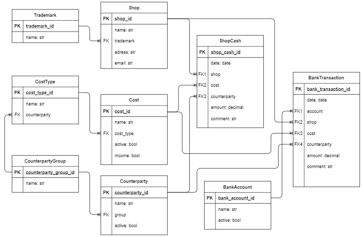
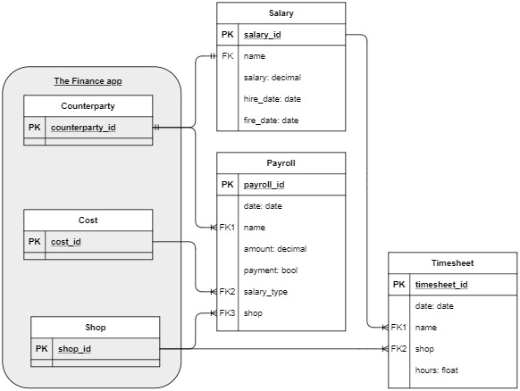

# Finance management

This application is a Django web application created for use in a chain of cooked food outlets. It allows managers to take into account cash flow, banking transactions, working hours of employees, and calculate wages. Shop administrators enter data into [`cash flow reports`](#Cash%20flow%20report) and [`timesheets`](#The%20daily%20timesheet%20of%20a%20shop). For the manager of the chain, [`monthly analysis`](#The%20monthly%20analysis) is provided, as well as all information for each shop and [`the bank statements`](#The%20bank%20statements).
  
## Authentication and authorization

Create a superuser account (a user who has all permissions) using the createsuperuser command:

> $ python manage.py createsuperuser --username=joe --email=joe@example.com

You will be prompted for a password. After you enter one, the user will be created immediately. If you leave off the *--username* or *--email* options, it will prompt you for those values.

Superusers have access to the ***Django admin site***. There is an *Admin* link on the top navigation bar to go there.  
You should see a link to ***“Groups”*** in the ***“Auth”*** section of the main admin index page. Groups can be created, and permissions can be assigned to groups of users at the ***“Add group”*** admin page. It is recommended to set the following permissions for the **Shops group**:
- finance/bank transaction - add, change, delete
- finance/shop cash - add, change, delete, view
- staff/payroll - add, change, delete
- staff/ time sheet - add, change, delete, view  

The ***“Add user”*** admin page requires you to choose a username and password before allowing you to edit the rest of the user’s fields. When creating a user from the **Shops group**, it is recommended to specify in the first_name field the shop name identical to the name field in the corresponding [`Shop model`](#Models) object. This is necessary for the user from the **Shops group** to have access only to his pages of [`cash flow reports`](#Cash%20flow%20report) and [`timesheets`](#The%20daily%20timesheet%20of%20a%20shop). When trying to access the pages of other stores, he will get to the ***No_access*** page.  

When the **Shops group** user enters the application and logs in he gets to the ***Greeting*** page from where he can choose what data he wants to record - cash flow reports or timesheets. When the superuser enters the application and logs in he gets to the page with [`financial analytics`](#The%20monthly%20analysis) for the current month.  

## The Finance app

### Models

The picture below shows the database layout of the **Finance app**, where each model maps to a single database table.

Only a superuser can add data to the following tables via the ***Admin*** page: **Trademark**, **Shop**, **CostType**, **Cost**, **CounterpartyGroup**, **Counterparty**, and **BankAccount**. A row set from the **ShopCash** table for a definite date is [`the daily cash flow report`](#Cash%20flow%20report) of a shop. Likewise, [`a daily bank statement`](#The%20bank%20statements) is a set of rows from the **BankTransaction** table for a specific date.

For correct work, it is necessary that the app accurately identifies the following costs - the opening day balance, the total revenue, the non-cash revenue, and the salary. For this purpose, ***settings.py*** defines four global variables, which are assigned the id value of these costs. We recommend the following values for these variables:
- BALANCE = 1
- REVENUE = 2
- BANK = 3
- SALARY = 4

### Cash flow report

To view the report, a user first gets to a page to select the date from where the app redirects him to the report page.  
The report page displays the data already existing in the database filtered by the shop and by the date. And there is also a form for entering new data on the page displayed after clicking *Add data*.  

The form fields correspond to the **ShopCash** model, with some exceptions - the **Shop** and **Date** fields are hidden (the app fills them in automatically), and there is the **CostType** field additionally. When the value of the **CostType** field is selected, javascript sends a fetch request to the server. In return, it gets a list of related costs and a list of related counterparties (if any) and puts them in the datalists of the **Cost** and **Counterparty** fields.  
When the form is submitted, the page reloads. And the app saves new data in the **Shopcash** table and displays it in the report with the rest of the existing records. If the cost field value of the new data is **Noncash revenue** or one of the costs with the **Salary** type, then this data is also recorded in the **BankTransaction** or **Payroll** tables (in the **[`Staff app`](#The%20Staff%20app)**), respectively.  

Each row of the report has links to edit and delete. If the selected row has its analog in the **BankTransaction** or **Payroll** tables, editing and deleting will be performed with these analogs as well.  

After entering all the data in the daily cash flow report, the user should click on the *Report is completed*. After that, the database will save the balance for the beginning of the next day, and the form for adding data will not be available. If a user is a superuser, he will be redirected to the monthly analysis of the shop. The ***Greeting*** page will be opened to other users.  

### The monthly analysis

A monthly analysis of a shop is a page with [`cash flow reports`](#Cash%20flow%20report) for the month. By default, the current month is selected, but there is functionality to switch between adjacent months.  
On the page, the table groups the data by type of expenses. The app displays data by **Revenue** type as **Cash revenue** and calculates them as the difference between **Total revenue** and **Noncash revenue**.  
If a user wants to see data on costs of some type, he can click on plus sign next to the name of the cost type. Under the row of cost type, he will see lines with cost data of this type.  
The app makes sure that the cash register balance at the end of the day is equal to the balance at the beginning of the next day. In the case of inequality, the balance at the beginning of the day will be displayed in red.

Total monthly analysis is a page with the financial results of all shops for the month.  
On the page, the table shows **Total revenue** and all costs from cash flow reports and bank statements grouped by type of expenses. The app provides an opportunity to see data on the costs of a particular type.  
The table also shows the share of each expense in total revenue and the profitability of each store.

### The bank statements

To see the bank statements, first, a superuser needs to select the date. The page of the bank statements displays several tables.

Firstly, it is a table with the rows created at the same time as recording the non-cash revenue in [`the cash flow reports`](#Cash%20flow%20report). The rows in this table have an empty value of the **Account** field. If a user fills the **Account** field in the row, the row will move from this table to the table of the corresponding account.

Also, on the page, there are tables with data on each bank account. Each time the page is updated, the app calculates the balance of each account at the end of the day and stores this data in the database as the account balance at the beginning of the next day. To preserve the continuity of data transfer it is recommended to open the bank page sequentially for each day, even if there were no movements in bank accounts on that day.

The page has a form for entering new data, which is the same as the one on [`the cash flow report`](#Cash%20flow%20report) page. And a user can also edit and delete rows in each table.

## The Staff app

### Models

The picture below shows the database layout of the **Staff app**, where each model maps to a single database table.

Only a superuser can add data to the **Salary** table via the ***Admin page***. A row set from the **Timesheet** table for a definite date is [`the daily timesheet`](#The%20daily%20timesheet%20of%20a%20shop) of a shop. Both superusers and users from the **Shops group** have access to the **Payroll** table. A superuser has direct access via the ***Admin page***, and other users will enter data to the table indirectly via [`cash flow report`](#Cash%20flow%20report).

### The Salary table

The **Salary** table is used to set the wage rate of employees.  
The app works in such a way that a superuser can only add the **Employee** type counterparties to a new row of the **Salary** table and only those who are not yet in the table.  
A superuser can change the wage rate for an employee on the ***'change'*** admin page, where the list of employees is displayed in alphabetical order.

This app provides for setting the wage rate per hour of work.

### The daily timesheet of a shop

The daily timesheet of a shop is one of two daily reports that can be filled in by users from the **Shops group**.  
The page of the daily timesheet has a form for entering the number of working hours of staff and a table with already existing data for the day.  
After entering all the data in the daily timesheet, a user should click on the *Timesheet is completed*. If a user is a superuser, he will be redirected to the monthly timesheet of the shop. The ***Greeting*** page will be opened to other users.

### Calculate salary

The app calculates wages twice a month - 16th day for the first half of the month and 1st day for the second half of the month. For this purpose, the **Salary** table has the admin action *Calculate salary to the marked employees*. A superuser may mark individual employees for this action or may select all employees who have not been fired and calculate their salaries.

When a user selects employees and clicks *Go*, a window will appear where he will have to set the month and the first or second half of the month for which the salary should be calculated. After receiving the data, the app will calculate the salary for each marked employee and create the corresponding rows in the **Payroll** table with the value of the field **Payment** = *False*. 

### The monthly analysis

The monthly timesheet page shows the list of employees, who worked in the shop this month. On the page, a superuser can see the total number of hours worked per month as well as the hours worked per day for each employee.

The page with the salary for the month shows the list of all employees. For each employee, the following data are displayed: the balance of salary for the previous month, payments, accruals, and due for payment for the first and the second half of the month.
